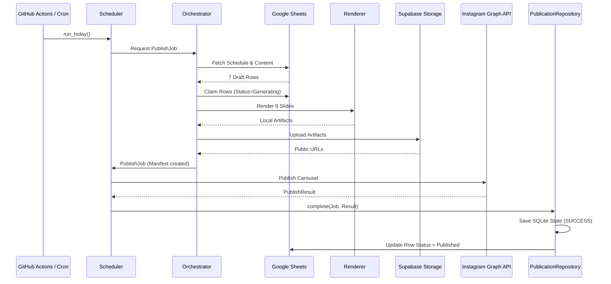
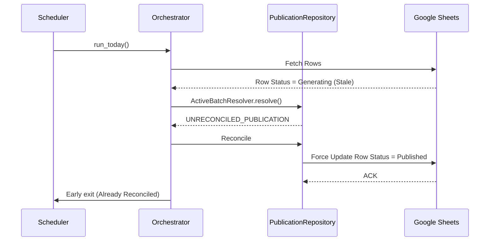

# Sequence Diagrams

## Daily Orchestration Flow

```mermaid
sequenceDiagram
    participant GH as GitHub Actions / Cron
    participant SCH as Scheduler
    participant ORC as Orchestrator
    participant GSheet as Google Sheets
    participant RND as Renderer
    participant SUP as Supabase Storage
    participant IG as Instagram Graph API
    participant REP as PublicationRepository

    GH->>SCH: run_today()
    SCH->>ORC: Request PublishJob
    
    ORC->>GSheet: Fetch Schedule & Content
    GSheet-->>ORC: 7 Draft Rows
    ORC->>GSheet: Claim Rows (Status=Generating)
    
    ORC->>RND: Render 9 Slides
    RND-->>ORC: Local Artifacts
    
    ORC->>SUP: Upload Artifacts
    SUP-->>ORC: Public URLs
    
    ORC->>SCH: PublishJob (Manifest created)
    
    SCH->>IG: Publish Carousel
    IG-->>SCH: PublishResult
    
    SCH->>REP: complete(Job, Result)
    REP->>REP: Save SQLite State (SUCCESS)
    REP->>GSheet: Update Row Status = Published
```

## Reconciliation Flow (Recovery)

```mermaid
sequenceDiagram
    participant SCH as Scheduler
    participant ORC as Orchestrator
    participant REP as PublicationRepository
    participant GSheet as Google Sheets

    SCH->>ORC: run_today()
    ORC->>GSheet: Fetch Rows
    GSheet-->>ORC: Row Status = Generating (Stale)
    
    ORC->>REP: ActiveBatchResolver.resolve()
    REP-->>ORC: UNRECONCILED_PUBLICATION
    
    ORC->>REP: Reconcile
    REP->>GSheet: Force Update Row Status = Published
    GSheet-->>REP: ACK
    
    ORC->>SCH: Early exit (Already Reconciled)
```
